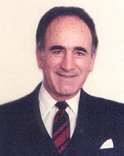

layout: true
  
<div class="my-footer"><span>

<a>Vítor Bernardo Silveira Pereira</a> - Email: <a href="mailto:vitorpereira3115@gmail.com">vitorpereira3115@gmail.com</a>
</span></div>

---
class: middle
```{r setup, include=FALSE}
options(htmltools.dir.version = FALSE)
knitr::opts_chunk$set(echo = FALSE, fig.align = "center", message=FALSE, warning=FALSE, cache = TRUE)

```


```{r}
library(knitr)
library(tidyverse)
library(widgetframe)
library(interactingan)
#xaringan::inf_mr()
```
# Motivação

- A indentificação de uma **distribuição** apropropriada é muito importante para a **análise estatística**;
- A distribuição Dagum, idealizada por Camilo Dagum, tem ganhado muita atenção na sua utilidade para modelagem de dados sobre a distribuição de renda e análise de confiabilidade.
- Distribuições baseadas na Dagum:
  - Distribuição exponenciada **Kumaraswamy-Dagum** (Silva et al., 2015);
  - Distribuição **Dagum Exponencial Generalizada Exponencializada** proposta em (Nasiru et al., 2019);
  - **Gompertz Generalizada**, proposta por El-Gohary et al. (2013), entre outros...
--

- Os modelos de **Regressão Linear Normal** e **Modelos Lineares Generalizados** possuem como pressuposto que a distribuição seja Normal ou pertença a família exponencial regular;

- Na prática, existem dados que não se adequam a distribuição normal ou distribuições pertecentes a familia exponencial, então nos últimos anos vêm sendo propostos **modelos alternativos**;

---
class: middle

# Motivação

- Nos novos modelos, tem-se uma reparametrização em termos da média ou quantil, para possibilitara interpretação dos parâmetros em termos de medidas de posição ou precisão; 

- Com a reparametrização, uma estrutura de regressão é incluída para **modelar a média ou o quantil**, assim tendo a mesma abordagem dos MLG'S;

--

- Na **EGEDD**, no entanto, **não há forma fechada para média e variância**, desta forma reparametrizamos a distribuição em termos dos quantis;


- Em Séries Temporais, uma das abordagens mais usuais é a metodologia Box e Jenkins, no entanto também estão surgindo modelos alternativos, denominados de **modelos dinâmicos**;

- Assim a proposta do projeto, é **desenvolver um novo modelo (modelo dinâmico)  com suporte nos reais**, baseando-se na EGEDD e na distrubuição Dagum; 

---
class: middle

# Aplicações

- Principalmente na área da modelagem de dados de sobrevivência e em dados econômicos, como análise de confiabilidade, modelagem de renda pessoal e nacionais (micro e macroeconômico).    


```{r message=FALSE, warning=FALSE, out.width="40%", cache = TRUE, fig.cap="<center><a href='https://es.wikipedia.org/wiki/Camilo_Dagum'><b>Augusto Dagum: </a> </b>Um dos maiores economistas e estatísticos latinos</center>"}

```

---
class: middle

# Propriedades da EGED


## Função de distribuição acumulada
$$F_Y(y)=1-\left\{1-\left[1-\left(1-\left(1+\alpha y^{-\delta}\right)^{-\sigma}\right)^{\gamma}\right]^{\eta}\right\}^{\lambda}$$

--

## Suporte
$$y > 0$$
--

## Paramêtros

$$\alpha,\sigma,\lambda,\delta,\eta,\gamma > 0$$
--

Os parâmetros $\sigma,\lambda,\delta,\eta,\gamma$ são parâmetros de forma e o parâmetro $\alpha$ é de escala.

---
class: middle

## Função Quantílica
$$Q_Y(\tau)=\left\{\frac{1}{\alpha}\left[\left(1-\left(1-\left(1-(1-\tau)^\frac{1}{\lambda}\right)^\frac{1}{\eta}\right)^{\frac{1}{\gamma}}\right)^{-\frac{1}{\sigma}}-1\right]\right\}^{-\frac{1}{\delta}}, \mbox{ onde }           \quad \tau \in (0,1).$$

## Função densidade de probabilidade
$$f_Y(y)= \frac{\alpha\sigma\lambda\delta\eta\gamma\left(1+\alpha y^{-\delta}\right)^{-\sigma-1}\left[1-\left(1+\alpha y^{-\delta}\right)^{-\sigma}\right]^{\gamma-1}}{y^{\delta+1}\left\{1-\left[1-\left(1-\left(1+\alpha y^{-\delta}\right)^{-\sigma}\right)^{\gamma}\right]^{\eta}\right\}^{1-\lambda}}$$

$$*[1-(1-(1+\alpha y^{-\delta})^{-\sigma})^{\gamma}]^{\eta-1}$$

---

class: middle
# Submodelos da EGEDD

<table>
<thead>
  <tr>
    <th>Distribuição</th>
    <th>&alpha;</th>
    <th>&lambda;</th>
    <th>&sigma;</th>
    <th>&delta;</th>
    <th>&eta;</th>
    <th>&gamma;</th>
  </tr>
</thead>
<tbody>
  <tr>
    <td><b>EGDD</b></td>
    <td>&alpha;</td>
    <td>1</td>
    <td>&sigma;</td>
    <td>&delta;</td>
    <td>&eta;</td>
    <td>&gamma;</td>
  </tr>
  <tr>
    <td><b>DD</b></td>
    <td>&alpha;</td>
    <td>1</td>
    <td>&sigma;</td>
    <td>&delta;</td>
    <td>1</td>
    <td>1</td>
  </tr>
  <tr>
    <td><b>EGEBD</b></td>
    <td>1</td>
    <td>&lambda;</td>
    <td>&sigma;</td>
    <td>&delta;</td>
    <td>&eta;</td>
    <td>&gamma;</td>
  </tr>
  <tr>
    <td><b>DB</b></td>
    <td>1</td>
    <td>1</td>
    <td>&sigma;</td>
    <td>&delta;</td>
    <td>1</td>
    <td>1</td>
  </tr>
  <tr>
    <td><b>EGBD</b></td>
    <td>1</td>
    <td>1</td>
    <td>&sigma;</td>
    <td>&delta;</td>
    <td>&eta;</td>
    <td>&gamma;</td>
  </tr>
  <tr>
    <td><b>EGEFD</b></td>
    <td>&alpha;</td>
    <td>&lambda;</td>
    <td>1</td>
    <td>&delta;</td>
    <td>&eta;</td>
    <td>&gamma;</td>
  </tr>
  <tr>
    <td><b>EGFD</b></td>
    <td>&alpha;</td>
    <td>1</td>
    <td>1</td>
    <td>&delta;</td>
    <td>&eta;</td>
    <td>&gamma;</td>
  </tr>
  <tr>
    <td><b>FD</b></td>
    <td>&alpha;</td>
    <td>1</td>
    <td>1</td>
    <td>&delta;</td>
    <td>1</td>
    <td>1</td>
  </tr>
</tbody>
</table>

Notamos que existes parâmetros melhores para fazer as reparametrizações, sem perder a generalidade da EGED como o $\delta$.

---
class: middle

# Reparametrizações
$$\mu=\left\{\frac{1}{\alpha}\left[\left(1-\left(1-\left(1-\left(1-\tau\right)^\frac{1}{\lambda}\right)^\frac{1}{\eta}\right)^{\frac{1}{\gamma}}\right)^{-\frac{1}{\sigma}}-1\right]\right\}^{-\frac{1}{\delta}}$$

--

## Repametrização por &alpha;

$$\alpha=\frac{1}{\mu^{-\delta}}\left\{\frac{1}{\alpha}\left[\left(1-\left(1-\left(1-0,5^\frac{1}{\lambda}\right)^\frac{1}{c}\right)^{\frac{1}{d}}\right)^{-\frac{1}{\sigma}}-1\right]\right\}.$$
--

## Reparametrização por &delta;
$$\delta=-\frac{1}{\log(\mu)}\log\left\{\frac{1}{\alpha}\left[\left(1-\left(1-\left(1-\left(1-\tau\right)^\frac{1}{\lambda}\right)^\frac{1}{\eta}\right)^{\frac{1}{\gamma}}\right)^{-\frac{1}{\sigma}}-1\right]\right\}$$
---
class: middle


# Regressão Dagum
Incluindo a estrutura de regressão pelo quantil, por:
$$g(\mu_t)={x}_t^{\top}{\boldsymbol{\beta}}=\sum_{j=1}^{k}{x}_{tj}{\boldsymbol{\beta}}=\eta_t, \quad t=1, \ldots, n,$$
$$com\quad {\boldsymbol\beta}=(\beta_1, \ldots, \beta_k)^{\top}$$
--

## Função de ligação
Necessita ser contínua e duas vezes diferenciável, logo a nossa função de ligação é $g({\mu_t})=\log({\mu_t})$, então temos:

$$\mu_t=\exp\left({x_t}^\top{\boldsymbol\beta}\right)=\exp(\eta_t)$$
Assim, ficaremos com o vetor de parâmetros, sendo:
$${\boldsymbol\theta}=(\alpha,\sigma,\lambda,\eta,\gamma,{\boldsymbol\beta^{\top}})^{\top}$$ 
Em que $\mu_t$ é o quantil da observação $y_t$ no tempo $t$.
---
class: middle

# Modelo DARMA(p,q)

Modelo geral para $\mu_t$:

$$g(\mu_t) = {x}_t^{\top}{\boldsymbol\beta} + u_t $$
Sabendo que pela estrutura ARMA temos uma relação que inclui o componente $u_t$:
$$u_t = \frac{\phi(B)}{\theta(B)}\epsilon_t$$
--
Ficando:

$$g(\mu_t) = {x}_t^{\top}{\boldsymbol\beta} + \frac{\phi(B)}{\theta(B)}\epsilon_t$$

Onde: 


$$\phi(Z)=-\sum_{i=0}^{p}\phi_iz^i,\quad \theta(Z)=-\sum_{j=0}^{q}\theta_iz^i$$

---
class: middle

Desenvolvendo um pouco algebricamente, conseguimos:
$$\phi(B)(g(\mu_t) -{x}_t^{\top}{\boldsymbol\beta}) = \phi(B)\epsilon_t$$

$$\left(1\:-\:\phi _1B \:-\:\phi _2B ^2,\:\ldots ,\:\phi _pB ^p\:\right)\left(g\left(\mu _t\right)\:-x_t^{\top } \right)\:=\:\phi \left(B\right)\epsilon _t$$
--


Até chegar no:

## Modelo final ARMA:
$$g(\mu_t) = \sum _{p=1}^n\phi_p(g(\mu_t) -{x}_t^{\top}{\boldsymbol\beta}) + \phi(B)\epsilon_t + {x}_t^{\top}{\beta}$$
---
class: middle
# Estimação dos parâmetos

- A estimação dos parâmetros será realizada através de Estimadores de Máxima Verossimilhança (EMV) e a máxima $L_q$-verossimilhança (M$L_q$E), com o vetor de parâmetros:

$$\boldsymbol{\theta}=(\alpha,\sigma,\gamma,\eta,\lambda,\delta)$$
--

## Função de log-verossimilhança:

$$\ell_t(\boldsymbol{\theta},y_t) = \log(\alpha\delta\sigma\gamma\eta\lambda)-(\delta+1)\log(y_t)-(\sigma+1)\log(z_t)+(\gamma-1)\log\left(1-z_t^{-\sigma}\right)$$
$$+(\eta-1)\log\left[1-\left(1-z_t^{-\sigma}\right)^\gamma\right]+(\lambda-1)\log\left\{1-\left[1-\left(1-z_t^{-\sigma}\right)^\gamma\right]^\eta\right\}$$
---
class: middle
# Estimação dos parâmetos

## Estimador
 - Para encontramos o EMV, só precisamos derivar a função em relação ao parâmetro e igualar a zero, porém em algumas derivadas, temos dificuldade algébrica igualar a zero, então usamos métodos numéricos, como a derivada a baixo:
 
$$\frac{\partial l}{\partial \sigma } = \frac{n}{\sigma} - \sum_{i=0}^{n}log(z_i) + (\gamma - 1)\sum_{i=0}^{n}\frac{z_i^{-\sigma}log(z_i)}{1-z_i^{-\sigma}}$$
$$- (\eta - 1)\sum_{i=0}^{n}\frac{\gamma{z_i}^{-\sigma}(1-z_i^{-\sigma})^{\gamma - 1}log(z_i)}{1 - (1-z_i^{-\sigma})^{\gamma}}$$

--
## Reparametrização
 - Para colocar a estrutura de regressão, temos que utilizar a reparametrizão, por exemplo para $\delta$, assim o vetor de parâmetros fica:

$$\boldsymbol{\theta}=(\alpha,\sigma,\gamma,\eta,\lambda,\boldsymbol{\beta}^\top).$$

---
class: middle

# Outros Procedimentos Estatísticos:
- Construção de testes de hipótese para verificar distribuição dos dados, verificando se é para a EGEDD ou um submodleo;
- Utilização de métodos númericos para execução de simulações (Newton-Rapson, Gosolnp com os métodos CG, BFGS e L-BFGS-B);
- Utilização de Simulações de Monte Carlo para estimação de parâmetros e análise de diagnósticos dos modelos;
- Desenvolvimento de Intervalos de Confiança e testes de hipóteses baseados na distribuição assintótica dos EMV's;
- Utilização dos estimadores de Entropia Extensiva;
- Aplicação a dados reais.


---
```{r}
knitr::include_app("https://vitorpereira.shinyapps.io/EGEDD_FDP/")
#build_pdf("docs/index.html", complex_slides = TRUE, partial_slides = TRUE)
```


